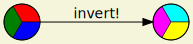

# GraphvizDotLang.jl
[](https://jhidding.github.io/GraphvizDotLang.jl)

Module for generating graphs in the Dot language (aka GraphViz).

```julia
using GraphvizDotLang: digraph, node, edge, attr, HTML, save

g = digraph(bgcolor="beige", rankdir="LR", ranksep="1") |>
        attr(:edge; fontname="Cantarell") |>
        attr(:node; shape="circle", style="filled,wedged") |>
        node("start"; label="", fillcolor="red:green:blue") |>
        node("end"; label="", fillcolor="cyan:magenta:yellow") |>
        edge("start", "end"; label="invert!")

save(g, ARGS[1])
```



- You need the Graphviz package to be installed (Debian: `apt install graphviz`, Fedora: `dnf install graphviz`, pick your poison). The `dot` command is expected to be somewhere in your `$PATH`.
- Please check the [documentation pages](https://jhidding.github.io/GraphvizDotLang.jl).
- Licensed under Apache v2, see LICENSE

